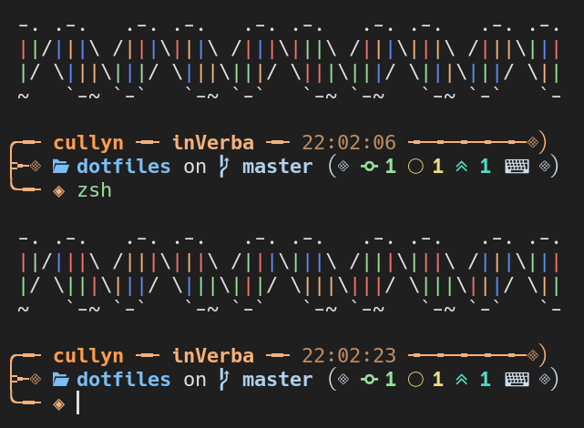
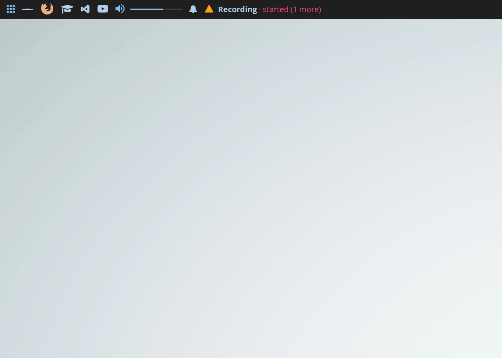
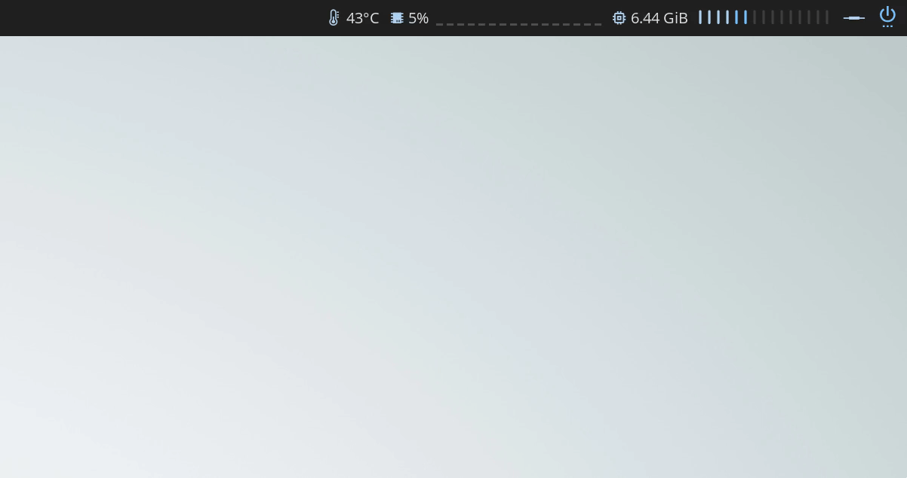
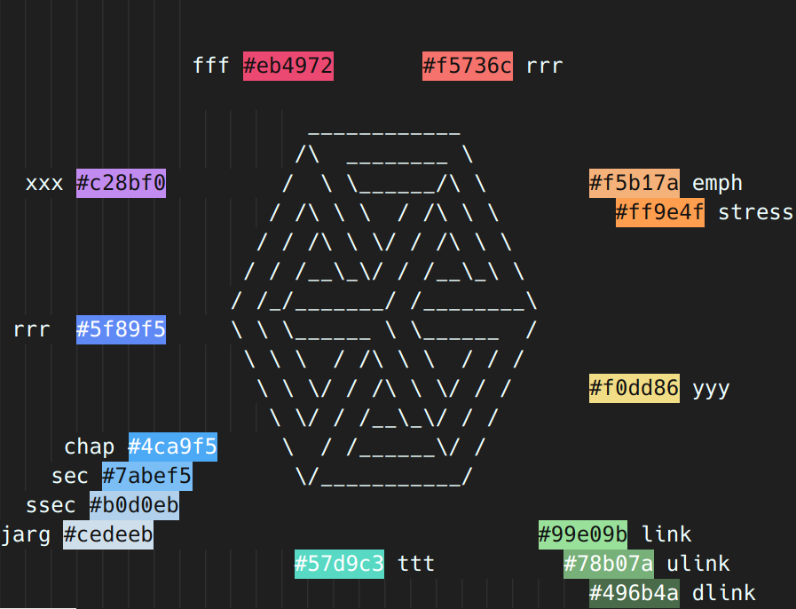
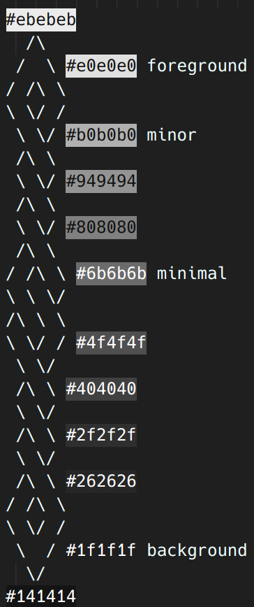
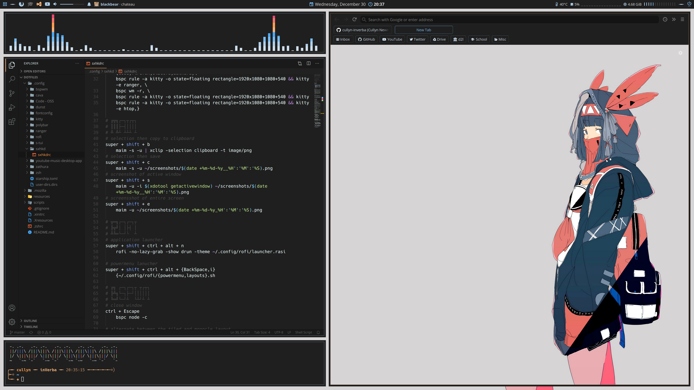
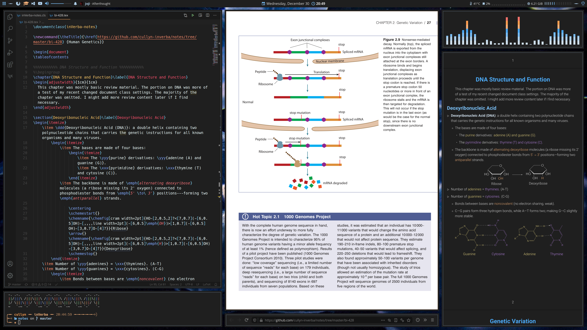
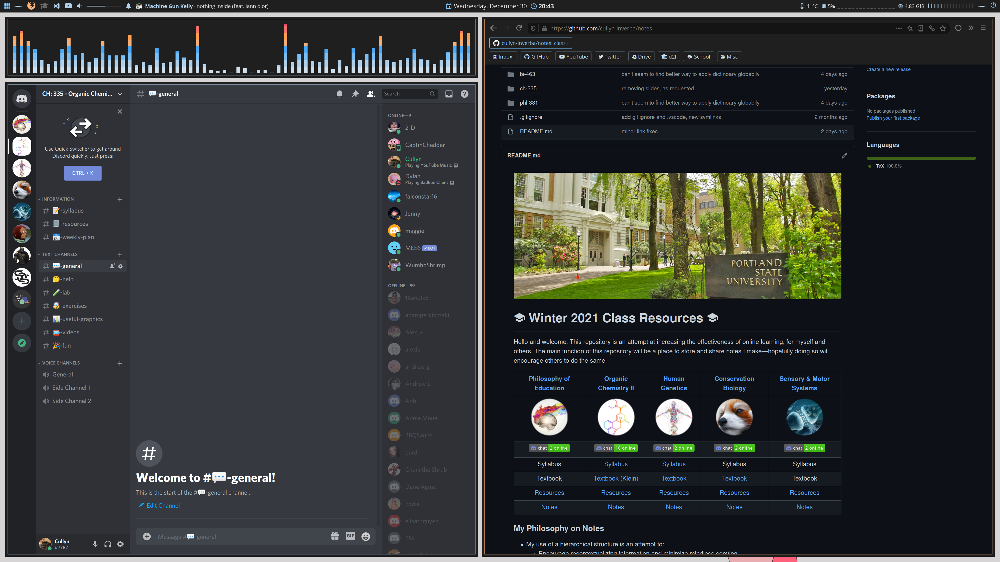

# General Information

- Distro: Arch Linux (vanilla)
- Window manager: bspwm
    - Double borders from [Barbarossa93's dotfiles](https://github.com/Barbarossa93/Forester) (also the starting point of my rice)
- Shell: zsh
- Prompt: [starship](https://starship.rs/), with custom DNA greeter (new basepairs each time!)

- Editor: Visual Studio Code, with modified dark material theme
- Browser: Firefox, heavily modified and minimal version of [eduardhojbota's Moonlight theme](https://github.com/eduardhojbota/moonlight-userChrome)
- Wallpapers: four different ones, found [here](resources/wallpapers)
- File manager: ranger
- Terminal: kitty
- Bar: polybar
- Launchers: modified versions of [adi1090x's rofi themes](https://github.com/adi1090x/rofi) (check out Adi's [polybar themes](https://github.com/adi1090x/polybar-themes) too)
  
- PDF viewer: zathura
- Notifications: dunst 
- Music: [ytmdesktop](https://github.com/ytmdesktop/ytmdesktop)&mdash;yes, I like YouTube Music
- Music visualizer: cava
- Fonts: Open Sans (serif), Roboto Slab (serif), Hack Nerd Font (monospace)
- gtk: slightly modified [Materia dark](https://github.com/nana-4/materia-theme) theme
- Icons: [vimix-icon-theme](https://aur.archlinux.org/packages/vimix-icon-theme/)
- Cursor: [vimix-cursors](https://aur.archlinux.org/packages/vimix-cursors/)
- Color-theme: custom theme, initially made for [my notes](https://github.com/cullyn-inverba/notes), and probably poorly implemented. References:
  | Colors | Contrast |
  |:---:|:---:|
  | | 

# Layouts

## Basic, Editor + Browser

## Notes, Editor + Browser/Textbook + PDF Output

## Discord + Browser

# Workflow Example

